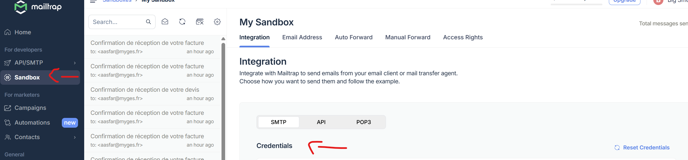

# facture_devis

Application de gestion de factures et devis  
Basée sur **Next.js**, **Prisma** et **React** en **DDD**.

---

## **Membres**:

Oussama FATNASSI, Amine ASFAR, Yaye Adama GUEYE, Yasmine LARBI et Mohamed Mounib OUROUA.

**Remarque: code mis à jour sur main ou Dev**

---

## Sommaire

- [facture\_devis](#facture_devis)
  - [**Membres**:](#membres)
  - [Sommaire](#sommaire)
  - [Fonctionnalités](#fonctionnalités)
  - [Prérequis](#prérequis)
  - [Installation](#installation)
  - [Configuration](#configuration)
  - [Préparation de la base de données](#préparation-de-la-base-de-données)
  - [Démarrer le projet](#démarrer-le-projet)
  - [Tests](#tests)

---

## Fonctionnalités

- Création et gestion de **factures** et **devis**
- Authentification JWT avec **bcryptjs**
- Génération de PDF (via **pdf-lib**)
- Envoi d’e-mails (via **nodemailer**)
- Interface moderne avec **React**, **Radix UI** et **TailwindCSS**

---

## Prérequis

- Node.js (version recommandée : 20+)
- npm
- **PostgreSQL** (pour la base de données)
- Un serveur SMTP (Mailtrap)

---

## Installation

1. **Cloner le dépôt :**

   ```bash
   git clone https://github.com/tonutilisateur/facture_devis.git
   cd facture_devis
   ```

## Configuration

1. **Créer le fichier .env à la racine du projet (voir .env.example) :**

   ```bash
    # Base de données PostgreSQL
    DATABASE_URL="postgresql://<user>:<password>@localhost:5432/<db_name>?schema=public"

    # URL publique de l’application
    NEXT_PUBLIC_APP_URL=http://localhost:3000

    # Configuration SMTP pour l’envoi d’e-mails
    SMTP_HOST=smtp.example.com
    SMTP_PORT=587
    SMTP_USER=ton_email@example.com
    SMTP_PASS=ton_mot_de_passe_smtp
   ```

   **Créez un compte MailTrap et ensuite dans l'onglet Sandbox et sous le volet 'SMTP' puis 'Credentials', vous trouverez les informations (Host, Port, Username, Password) de votre serveur SMTP de test (voir l'image ci-dessous) :**
   

## Préparation de la base de données

1. **Générer le client Prisma**
   ```bash
   npx prisma generate
   ```
2. **Créer la base de données et appliquer les migrations**
   ```bash
   npx prisma migrate dev
   ```

## Démarrer le projet

1. **Lancer le serveur de développement**
   ```bash
   npm run dev
   ```

## Tests

1. **Lancer les tests**
   ```bash
   npm run test
   ```
